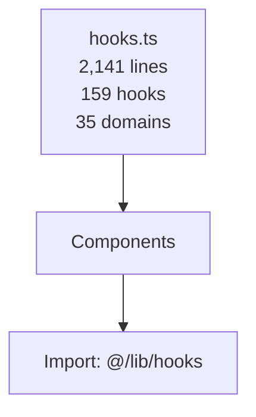
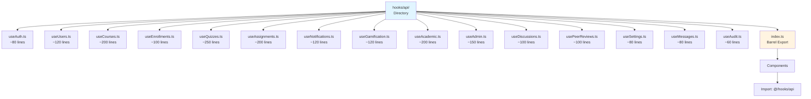
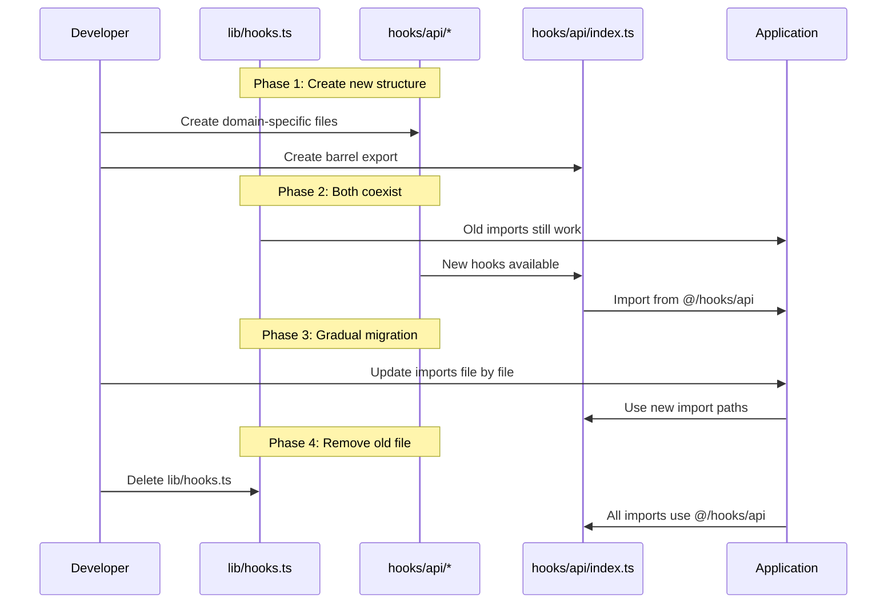

# Design Document: Hooks Refactoring Phase 2.1

## Overview

This document outlines the design for Phase 2.1 of the LMS frontend refactoring: splitting the massive `hooks.ts` file (2,141 lines, 159 hooks) into focused, domain-specific files. This refactoring improves code maintainability, navigability, and follows the Single Responsibility Principle while maintaining 100% backward compatibility through barrel exports.

The current `frontend/src/lib/hooks.ts` file contains all React Query hooks for the entire application, covering 35 distinct domains from authentication to gamification. This violates the Single Responsibility Principle and makes the codebase difficult to navigate and maintain.

## Architecture

### Current State



### Target State



### Migration Flow




## File Organization Strategy

### Domain Mapping

The 159 hooks are organized into 15 domain-specific files based on functional cohesion:

| File | Hooks Count | Estimated Lines | Primary Domain |
|------|-------------|-----------------|----------------|
| `useAuth.ts` | 3 | ~80 | Authentication & password management |
| `useUsers.ts` | 6 | ~120 | User CRUD & profile management |
| `useCourses.ts` | 13 | ~200 | Courses, modules, content authoring |
| `useEnrollments.ts` | 4 | ~100 | Student/teacher dashboards, enrollments |
| `useQuizzes.ts` | 16 | ~250 | Quizzes, attempts, grading, analytics |
| `useAssignments.ts` | 27 | ~200 | Assignments, submissions, peer reviews, file uploads |
| `useNotifications.ts` | 7 | ~120 | Notifications, announcements, preferences |
| `useGamification.ts` | 5 | ~120 | XP, badges, leaderboard, streak |
| `useAcademic.ts` | 27 | ~200 | Academic years, grades, sections, timetable |
| `useAdmin.ts` | 18 | ~150 | Admin roles, quality monitoring, auto-enroll, content moderation, escalations |
| `useDiscussions.ts` | 7 | ~100 | Discussions, replies |
| `usePeerReviews.ts` | 4 | ~100 | Peer reviews (assignments) |
| `useSettings.ts` | 8 | ~80 | Settings, maintenance, health checks |
| `useMessages.ts` | 3 | ~80 | Messages, conversations |
| `useAudit.ts` | 2 | ~60 | Audit logs, analytics, data exports |
| **Total** | **159** | **~1,960** | **15 files** |

### Design Principles

1. **Single Responsibility**: Each file handles one domain area
2. **Size Constraint**: Target 60-250 lines per file (none exceed 250)
3. **Functional Cohesion**: Related hooks grouped by business domain
4. **Backward Compatibility**: Barrel export maintains existing import paths
5. **Zero Breaking Changes**: All hook names and signatures preserved

### File Size Distribution

```
useAudit.ts         ████████░░░░░░░░░░░░  60 lines (24%)
useAuth.ts          ████████████████░░░░  80 lines (32%)
useMessages.ts      ████████████████░░░░  80 lines (32%)
useSettings.ts      ████████████████░░░░  80 lines (32%)
useEnrollments.ts   ████████████████████  100 lines (40%)
useDiscussions.ts   ████████████████████  100 lines (40%)
usePeerReviews.ts   ████████████████████  100 lines (40%)
useUsers.ts         ████████████████████████  120 lines (48%)
useNotifications.ts ████████████████████████  120 lines (48%)
useGamification.ts  ████████████████████████  120 lines (48%)
useAdmin.ts         ██████████████████████████████  150 lines (60%)
useCourses.ts       ████████████████████████████████████████  200 lines (80%)
useAcademic.ts      ████████████████████████████████████████  200 lines (80%)
useAssignments.ts   ████████████████████████████████████████  200 lines (80%)
useQuizzes.ts       ██████████████████████████████████████████████████  250 lines (100%)
```

All files stay well below the 1,000-line recommended maximum.


## Detailed Hook Mapping

### 1. useAuth.ts (~80 lines)

**Purpose**: Authentication and password management

**Hooks**:
- `useLogin()` - User login with JWT
- `useLogout()` - User logout
- `useChangePassword()` - Change user password

**Dependencies**:
- `@tanstack/react-query` - useMutation, useQueryClient
- `./api` - Axios client
- `./auth-store` - Zustand auth state

**API Endpoints**:
- `POST /auth/login`
- `POST /auth/logout`
- `PATCH /auth/change-password`

**Example Usage**:
```typescript
import { useLogin, useLogout, useChangePassword } from '@/hooks/api';

function LoginForm() {
  const login = useLogin();
  
  const handleSubmit = async (email: string, password: string) => {
    await login.mutateAsync({ email, password });
  };
  
  return <form onSubmit={handleSubmit}>...</form>;
}
```

---

### 2. useUsers.ts (~120 lines)

**Purpose**: User management and profile operations

**Hooks**:
- `useUsers(params?)` - List users with pagination/filters
- `useCreateUser()` - Create new user
- `useUpdateUser()` - Update user by ID
- `useDeleteUser()` - Delete user by ID
- `useMyProfile()` - Get current user profile
- `useUpdateMyProfile()` - Update current user profile

**Dependencies**:
- `@tanstack/react-query` - useQuery, useMutation, useQueryClient
- `./api` - Axios client
- `./auth-store` - Zustand auth state

**API Endpoints**:
- `GET /users` - List users
- `POST /users` - Create user
- `PATCH /users/:id` - Update user
- `DELETE /users/:id` - Delete user
- `GET /users/me` - Get current user
- `PATCH /users/me` - Update current user

**Example Usage**:
```typescript
import { useUsers, useCreateUser, useMyProfile } from '@/hooks/api';

function UserManagement() {
  const { data: users } = useUsers({ page: 1, limit: 20 });
  const createUser = useCreateUser();
  const { data: profile } = useMyProfile();
  
  return <div>...</div>;
}
```

---

### 3. useCourses.ts (~200 lines)

**Purpose**: Course management, modules, and content authoring

**Hooks**:
- `useCourses(params?)` - List courses with filters
- `useMyCourses(params?)` - List current user's courses
- `useCourse(id)` - Get single course details
- `useCreateCourse()` - Create new course
- `usePublishCourse()` - Publish course
- `useArchiveCourse()` - Archive course
- `useSelfEnroll()` - Student self-enrollment
- `useCreateModule(courseId)` - Create module in course
- `useUpdateModule(courseId)` - Update module
- `useDeleteModule(courseId)` - Delete module
- `useCreateContent(courseId)` - Create content in module
- `useUpdateContent(courseId)` - Update content
- `useDeleteContent(courseId)` - Delete content

**Dependencies**:
- `@tanstack/react-query` - useQuery, useMutation, useQueryClient
- `./api` - Axios client
- `./auth-store` - Zustand auth state

**API Endpoints**:
- `GET /courses` - List courses
- `POST /courses` - Create course
- `GET /courses/:id` - Get course
- `PATCH /courses/:id/publish` - Publish
- `PATCH /courses/:id/archive` - Archive
- `POST /courses/:id/self-enroll` - Enroll
- `POST /courses/:id/modules` - Create module
- `PATCH /courses/modules/:id` - Update module
- `DELETE /courses/modules/:id` - Delete module
- `POST /courses/modules/:id/contents` - Create content
- `PATCH /courses/contents/:id` - Update content
- `DELETE /courses/contents/:id` - Delete content

**Example Usage**:
```typescript
import { useCourses, useCreateCourse, useCreateModule } from '@/hooks/api';

function CourseManagement() {
  const { data: courses } = useCourses({ status: 'PUBLISHED' });
  const createCourse = useCreateCourse();
  const createModule = useCreateModule(courseId);
  
  return <div>...</div>;
}
```

---

### 4. useEnrollments.ts (~100 lines)

**Purpose**: Student and teacher enrollment dashboards

**Hooks**:
- `useStudentDashboard()` - Student dashboard data
- `useTeacherDashboard()` - Teacher dashboard data
- `useEnrollments(params?)` - List enrollments
- `useSelfEnroll()` - Self-enroll in course (moved from useCourses)

**Dependencies**:
- `@tanstack/react-query` - useQuery, useMutation, useQueryClient
- `./api` - Axios client
- `./auth-store` - Zustand auth state

**API Endpoints**:
- `GET /enrollments/dashboard/student`
- `GET /enrollments/dashboard/teacher`
- `GET /enrollments`
- `POST /courses/:id/self-enroll`

**Example Usage**:
```typescript
import { useStudentDashboard, useTeacherDashboard } from '@/hooks/api';

function Dashboard() {
  const { data: studentData } = useStudentDashboard();
  const { data: teacherData } = useTeacherDashboard();
  
  return <div>...</div>;
}
```


---

### 5. useQuizzes.ts (~250 lines)

**Purpose**: Quiz management, attempts, grading, and analytics

**Hooks**:
- `useQuizzes(params?)` - List quizzes
- `useQuizzesForContents(contentIds)` - Bulk fetch quizzes
- `useQuiz(id)` - Get single quiz
- `useStartQuizAttempt()` - Start quiz attempt
- `useSubmitQuizAttempt()` - Submit quiz answers
- `useAttemptResults(attemptId)` - Get attempt results
- `useManualGradeAttempt()` - Teacher manual grading
- `useAdminOverrideGrade()` - Admin grade override
- `useEscalateGrade()` - Escalate grade dispute
- `useGradeDisputes(params?)` - List grade disputes
- `useResolveDispute()` - Resolve grade dispute
- `useCreateQuiz()` - Create quiz (authoring)
- `useUpdateQuiz()` - Update quiz
- `useUpdateQuestion()` - Update quiz question
- `useQuizAttempts(quizId)` - Teacher view submissions
- `useQuizAnalytics(quizId)` - Quiz analytics

**Dependencies**:
- `@tanstack/react-query`
- `./api`
- `./auth-store`

**API Endpoints**:
- `GET /quizzes` - List
- `GET /quizzes/:id` - Get single
- `POST /quizzes/:id/attempts/start` - Start
- `POST /quizzes/attempts/:id/submit` - Submit
- `GET /quizzes/attempts/:id/results` - Results
- `PATCH /quizzes/attempts/:id/grade` - Grade
- `PATCH /quizzes/attempts/:id/admin-grade` - Override
- `POST /quizzes/attempts/:id/escalate` - Escalate
- `GET /quizzes/disputes` - Disputes
- `PATCH /quizzes/disputes/:id/resolve` - Resolve
- `POST /quizzes` - Create
- `PATCH /quizzes/:id` - Update
- `PATCH /quizzes/:id/questions/:qid` - Update question
- `GET /quizzes/:id/attempts` - Attempts
- `GET /quizzes/:id/analytics` - Analytics

**Example Usage**:
```typescript
import { useQuiz, useStartQuizAttempt, useSubmitQuizAttempt } from '@/hooks/api';

function QuizRunner({ quizId }: { quizId: string }) {
  const { data: quiz } = useQuiz(quizId);
  const startAttempt = useStartQuizAttempt();
  const submitAttempt = useSubmitQuizAttempt();
  
  return <div>...</div>;
}
```

---

### 6. useAssignments.ts (~200 lines)

**Purpose**: Assignment management, submissions, peer reviews, file uploads

**Hooks**:
- `useAssignments(params?)` - List assignments
- `useAssignmentsForContents(contentIds)` - Bulk fetch
- `useAssignment(id)` - Get single assignment
- `useCreateAssignment()` - Create assignment
- `useSubmissions(assignmentId)` - List submissions
- `useCreateSubmission()` - Submit assignment
- `useUploadFile()` - Upload file to Cloudinary
- `useGradeSubmission()` - Grade submission
- `useRequestRevision()` - Request revision
- `useMyPeerReviews()` - My peer reviews
- `useReceivedPeerReviews(assignmentId)` - Received reviews
- `useSubmitPeerReview()` - Submit peer review
- `useGetPlagiarismReport(submissionId)` - Plagiarism check
- `useRunPlagiarismCheck(submissionId)` - Run plagiarism
- `useGetSubmissionAnalytics(submissionId)` - Submission stats
- `useBulkGrade()` - Bulk grading
- `useExportGrades(assignmentId)` - Export grades

**Dependencies**:
- `@tanstack/react-query`
- `./api`
- `./auth-store`

**API Endpoints**:
- `GET /assignments` - List
- `GET /assignments/:id` - Get single
- `POST /assignments` - Create
- `GET /assignments/:id/submissions` - List submissions
- `POST /assignments/:id/submissions` - Submit
- `POST /assignments/upload` - Upload file
- `POST /assignments/submissions/:id/grade` - Grade
- `POST /assignments/submissions/:id/revision` - Request revision
- `GET /assignments/peer-reviews/my` - My reviews
- `GET /assignments/:id/peer-reviews/my-received` - Received
- `POST /assignments/peer-reviews/:id/submit` - Submit review
- `GET /assignments/submissions/:id/plagiarism` - Plagiarism
- `POST /assignments/submissions/:id/plagiarism/run` - Run check
- `GET /assignments/submissions/:id/analytics` - Analytics
- `POST /assignments/:id/bulk-grade` - Bulk grade
- `GET /assignments/:id/grades/export` - Export

**Example Usage**:
```typescript
import { useAssignment, useCreateSubmission, useUploadFile } from '@/hooks/api';

function AssignmentSubmission({ assignmentId }: { assignmentId: string }) {
  const { data: assignment } = useAssignment(assignmentId);
  const createSubmission = useCreateSubmission();
  const uploadFile = useUploadFile();
  
  return <form>...</form>;
}
```

---

### 7. useNotifications.ts (~120 lines)

**Purpose**: Notifications, announcements, and preferences

**Hooks**:
- `useNotifications(params?)` - List notifications
- `useMarkNotificationRead()` - Mark as read
- `useMarkAllNotificationsRead()` - Mark all read
- `useNotificationPreferences()` - Get preferences
- `useUpdateNotificationPreferences()` - Update preferences
- `useAnnouncements(params?)` - List announcements
- `useCreateAnnouncement()` - Create announcement

**Dependencies**:
- `@tanstack/react-query`
- `./api`
- `./auth-store`

**API Endpoints**:
- `GET /notifications` - List
- `PATCH /notifications/:id/read` - Mark read
- `PATCH /notifications/read-all` - Mark all
- `GET /notifications/preferences` - Get prefs
- `PATCH /notifications/preferences` - Update prefs
- `GET /announcements` - List
- `POST /announcements` - Create

**Example Usage**:
```typescript
import { useNotifications, useMarkNotificationRead } from '@/hooks/api';

function NotificationBell() {
  const { data: notifications } = useNotifications({ unread: true });
  const markRead = useMarkNotificationRead();
  
  return <div>...</div>;
}
```


---

### 8. useGamification.ts (~120 lines)

**Purpose**: XP, badges, leaderboard, and streak management

**Hooks**:
- `useMyGamification()` - Current user's gamification stats
- `useLeaderboard(params?)` - Global leaderboard
- `useBadges()` - List all badges
- `useXPHistory()` - XP activity feed
- `useStreak()` - Current streak data

**Dependencies**:
- `@tanstack/react-query`
- `./api`
- `./auth-store`

**API Endpoints**:
- `GET /gamification/me` - My stats
- `GET /gamification/leaderboard` - Leaderboard
- `GET /gamification/badges` - Badges
- `GET /gamification/xp-history` - XP history
- `GET /gamification/streak` - Streak

**Example Usage**:
```typescript
import { useMyGamification, useLeaderboard, useBadges } from '@/hooks/api';

function GamificationView() {
  const { data: myStats } = useMyGamification();
  const { data: leaderboard } = useLeaderboard({ period: 'weekly' });
  const { data: badges } = useBadges();
  
  return <div>...</div>;
}
```

---

### 9. useAcademic.ts (~200 lines)

**Purpose**: Academic structure (years, grades, subjects, sections, timetable)

**Hooks**:
- `useAcademicYears(params?)` - List academic years
- `useCreateAcademicYear()` - Create year
- `useUpdateAcademicYear()` - Update year
- `useDeleteAcademicYear()` - Delete year
- `useGrades(params?)` - List grades
- `useCreateGrade()` - Create grade
- `useUpdateGrade()` - Update grade
- `useDeleteGrade()` - Delete grade
- `useSubjects(params?)` - List subjects
- `useCreateSubject()` - Create subject
- `useUpdateSubject()` - Update subject
- `useDeleteSubject()` - Delete subject
- `useSections(params?)` - List sections
- `useSection(id)` - Get single section
- `useCreateSection()` - Create section
- `useUpdateSection()` - Update section
- `useDeleteSection()` - Delete section
- `useSectionCourses(sectionId)` - Section's courses
- `useAddCourseToSection()` - Add course
- `useRemoveCourseFromSection()` - Remove course
- `useTimetable(sectionId)` - Get timetable
- `useCreateTimetableSlot()` - Create slot
- `useUpdateTimetableSlot()` - Update slot
- `useDeleteTimetableSlot()` - Delete slot
- `useBulkCreateTimetableSlots()` - Bulk create
- `useMyTimetable()` - Current user's timetable
- `useTeacherTimetable()` - Teacher's timetable

**Dependencies**:
- `@tanstack/react-query`
- `./api`
- `./auth-store`

**API Endpoints**:
- `GET /academic/years` - Years
- `POST /academic/years` - Create year
- `PATCH /academic/years/:id` - Update
- `DELETE /academic/years/:id` - Delete
- `GET /academic/grades` - Grades
- `POST /academic/grades` - Create
- `PATCH /academic/grades/:id` - Update
- `DELETE /academic/grades/:id` - Delete
- `GET /academic/subjects` - Subjects
- `POST /academic/subjects` - Create
- `PATCH /academic/subjects/:id` - Update
- `DELETE /academic/subjects/:id` - Delete
- `GET /academic/sections` - Sections
- `GET /academic/sections/:id` - Get section
- `POST /academic/sections` - Create
- `PATCH /academic/sections/:id` - Update
- `DELETE /academic/sections/:id` - Delete
- `GET /academic/sections/:id/courses` - Courses
- `POST /academic/sections/:id/courses` - Add course
- `DELETE /academic/sections/:id/courses/:cid` - Remove
- `GET /academic/timetable/:sectionId` - Timetable
- `POST /academic/timetable` - Create slot
- `PATCH /academic/timetable/:id` - Update slot
- `DELETE /academic/timetable/:id` - Delete slot
- `POST /academic/timetable/bulk` - Bulk create
- `GET /academic/timetable/my` - My timetable
- `GET /academic/timetable/teacher` - Teacher timetable

**Example Usage**:
```typescript
import { useAcademicYears, useGrades, useSections, useTimetable } from '@/hooks/api';

function AcademicManagement() {
  const { data: years } = useAcademicYears();
  const { data: grades } = useGrades();
  const { data: sections } = useSections({ gradeId: selectedGrade });
  const { data: timetable } = useTimetable(sectionId);
  
  return <div>...</div>;
}
```

---

### 10. useAdmin.ts (~150 lines)

**Purpose**: Admin functions (roles, quality, auto-enroll, moderation, escalations)

**Hooks**:
- `useAdminRoles()` - List admin roles
- `useCreateAdminRole()` - Create role
- `useDeleteAdminRole()` - Delete role
- `useAssignAdminRole()` - Assign role to user
- `useRemoveAdminRole()` - Remove role from user
- `useAdmins()` - List admins
- `useQualityReport()` - Quality monitoring report
- `useRecalculateQuality()` - Recalculate quality scores
- `useFlagCourse()` - Flag course for quality
- `useUnflagCourse()` - Unflag course
- `useFlaggedContent(params?)` - List flagged content
- `useModerateContent()` - Moderate content
- `useAutoEnrollRules()` - List auto-enroll rules
- `useCreateAutoEnrollRule()` - Create rule
- `useDeleteAutoEnrollRule()` - Delete rule
- `useTriggerAutoEnroll()` - Trigger auto-enrollment
- `useEscalations(params?)` - List escalations
- `useCreateEscalation()` - Create escalation
- `useTeacherResolveEscalation()` - Teacher resolve
- `useAdminResolveEscalation()` - Admin resolve

**Dependencies**:
- `@tanstack/react-query`
- `./api`
- `./auth-store`

**API Endpoints**:
- `GET /admin/roles` - Roles
- `POST /admin/roles` - Create
- `DELETE /admin/roles/:id` - Delete
- `POST /admin/users/:id/role` - Assign
- `DELETE /admin/users/:id/role` - Remove
- `GET /admin/admins` - Admins
- `GET /admin/quality/reports` - Quality
- `POST /admin/quality/recalculate` - Recalc
- `PATCH /admin/quality/courses/:id/flag` - Flag
- `PATCH /admin/quality/courses/:id/unflag` - Unflag
- `GET /content/flagged` - Flagged
- `PATCH /content/:id/moderate` - Moderate
- `GET /admin/auto-enrollment/rules` - Rules
- `POST /admin/auto-enrollment/rules` - Create
- `DELETE /admin/auto-enrollment/rules/:id` - Delete
- `POST /admin/auto-enrollment/trigger` - Trigger
- `GET /escalations` - Escalations
- `POST /escalations` - Create
- `PATCH /escalations/:id/resolve` - Teacher
- `PATCH /escalations/:id/admin-resolve` - Admin

**Example Usage**:
```typescript
import { useAdminRoles, useQualityReport, useFlaggedContent } from '@/hooks/api';

function AdminDashboard() {
  const { data: roles } = useAdminRoles();
  const { data: quality } = useQualityReport();
  const { data: flagged } = useFlaggedContent();
  
  return <div>...</div>;
}
```


---

### 11. useDiscussions.ts (~100 lines)

**Purpose**: Discussion forums and replies

**Hooks**:
- `useDiscussions(params?)` - List discussions
- `useDiscussion(id)` - Get single discussion
- `useCreateDiscussion()` - Create discussion
- `useUpdateDiscussion()` - Update discussion
- `useDeleteDiscussion()` - Delete discussion
- `useCreateReply()` - Create reply
- `useDeleteReply()` - Delete reply

**Dependencies**:
- `@tanstack/react-query`
- `./api`
- `./auth-store`

**API Endpoints**:
- `GET /discussions` - List
- `GET /discussions/:id` - Get single
- `POST /discussions` - Create
- `PATCH /discussions/:id` - Update
- `DELETE /discussions/:id` - Delete
- `POST /discussions/:id/replies` - Create reply
- `DELETE /discussions/replies/:id` - Delete reply

**Example Usage**:
```typescript
import { useDiscussions, useCreateDiscussion, useCreateReply } from '@/hooks/api';

function DiscussionForum({ courseId }: { courseId: string }) {
  const { data: discussions } = useDiscussions({ courseId });
  const createDiscussion = useCreateDiscussion();
  const createReply = useCreateReply();
  
  return <div>...</div>;
}
```

---

### 12. usePeerReviews.ts (~100 lines)

**Purpose**: Peer review management (separate from main assignments)

**Hooks**:
- `useMyPeerReviews()` - My assigned peer reviews
- `useReceivedPeerReviews(assignmentId)` - Reviews I received
- `useSubmitPeerReview()` - Submit peer review
- `usePeerReviewStats(assignmentId)` - Peer review statistics

**Note**: This is extracted from useAssignments.ts for better separation of concerns. While peer reviews are related to assignments, they form a distinct workflow that deserves its own file.

**Dependencies**:
- `@tanstack/react-query`
- `./api`
- `./auth-store`

**API Endpoints**:
- `GET /assignments/peer-reviews/my` - My reviews
- `GET /assignments/:id/peer-reviews/my-received` - Received
- `POST /assignments/peer-reviews/:id/submit` - Submit
- `GET /assignments/:id/peer-reviews/stats` - Stats

**Example Usage**:
```typescript
import { useMyPeerReviews, useSubmitPeerReview } from '@/hooks/api';

function PeerReviewPanel() {
  const { data: reviews } = useMyPeerReviews();
  const submitReview = useSubmitPeerReview();
  
  return <div>...</div>;
}
```

---

### 13. useSettings.ts (~80 lines)

**Purpose**: System settings and maintenance

**Hooks**:
- `useSettings()` - Get settings
- `useUpdateSettings()` - Update settings
- `useMaintenanceMode()` - Get maintenance status
- `useToggleMaintenanceMode()` - Toggle maintenance
- `useBackupDatabase()` - Trigger backup
- `useRestoreDatabase()` - Restore backup
- `useSystemHealth()` - Health check
- `useClearCache()` - Clear system cache

**Dependencies**:
- `@tanstack/react-query`
- `./api`
- `./auth-store`

**API Endpoints**:
- `GET /settings` - Get
- `PATCH /settings` - Update
- `GET /settings/maintenance` - Status
- `POST /settings/maintenance/toggle` - Toggle
- `POST /settings/backup` - Backup
- `POST /settings/restore` - Restore
- `GET /health` - Health
- `POST /settings/cache/clear` - Clear

**Example Usage**:
```typescript
import { useSettings, useMaintenanceMode, useSystemHealth } from '@/hooks/api';

function SettingsPanel() {
  const { data: settings } = useSettings();
  const { data: maintenance } = useMaintenanceMode();
  const { data: health } = useSystemHealth();
  
  return <div>...</div>;
}
```

---

### 14. useMessages.ts (~80 lines)

**Purpose**: Direct messaging between users

**Hooks**:
- `useConversations()` - List conversations
- `useMessages(conversationId)` - Get messages
- `useSendMessage()` - Send message

**Dependencies**:
- `@tanstack/react-query`
- `./api`
- `./auth-store`

**API Endpoints**:
- `GET /messages/conversations` - Conversations
- `GET /messages/:conversationId` - Messages
- `POST /messages` - Send

**Example Usage**:
```typescript
import { useConversations, useMessages, useSendMessage } from '@/hooks/api';

function MessagingView() {
  const { data: conversations } = useConversations();
  const { data: messages } = useMessages(selectedConversation);
  const sendMessage = useSendMessage();
  
  return <div>...</div>;
}
```

---

### 15. useAudit.ts (~60 lines)

**Purpose**: Audit logs and data analytics

**Hooks**:
- `useAuditLogs(params?)` - Query audit logs
- `useDataExport()` - Export audit data

**Dependencies**:
- `@tanstack/react-query`
- `./api`
- `./auth-store`

**API Endpoints**:
- `GET /audit/logs` - Audit logs
- `POST /audit/export` - Export data

**Example Usage**:
```typescript
import { useAuditLogs, useDataExport } from '@/hooks/api';

function AuditLogViewer() {
  const { data: logs } = useAuditLogs({ 
    startDate: '2024-01-01', 
    action: 'USER_LOGIN' 
  });
  const exportData = useDataExport();
  
  return <div>...</div>;
}
```


## Implementation Details

### Barrel Export Pattern (index.ts)

The `hooks/api/index.ts` file serves as a barrel export, re-exporting all hooks from domain-specific files. This maintains backward compatibility and provides a clean import experience.

```typescript
// hooks/api/index.ts
export * from './useAuth';
export * from './useUsers';
export * from './useCourses';
export * from './useEnrollments';
export * from './useQuizzes';
export * from './useAssignments';
export * from './useNotifications';
export * from './useGamification';
export * from './useAcademic';
export * from './useAdmin';
export * from './useDiscussions';
export * from './usePeerReviews';
export * from './useSettings';
export * from './useMessages';
export * from './useAudit';
```

### Import Path Migration

**Before**:
```typescript
import { useLogin, useCourses, useQuizzes } from '@/lib/hooks';
```

**After**:
```typescript
import { useLogin, useCourses, useQuizzes } from '@/hooks/api';
```

### File Structure Template

Each domain-specific file follows this structure:

```typescript
'use client';

import { useQuery, useMutation, useQueryClient } from '@tanstack/react-query';
import { api } from '@/lib/api';
import { useAuthStore } from '@/lib/auth-store';

// ─── Domain Name ────────────────────────────────────────────────────────

export function useHookName() {
  const queryClient = useQueryClient();
  
  return useMutation({
    mutationFn: async (data: ParamType) => {
      const res = await api.post('/endpoint', data);
      return res.data;
    },
    onSuccess: () => {
      queryClient.invalidateQueries({ queryKey: ['key'] });
    },
  });
}

// Additional hooks...
```

### Shared Dependencies

All hook files share these common dependencies:

1. **React Query**: `@tanstack/react-query`
   - `useQuery` - Data fetching
   - `useMutation` - Data mutations
   - `useQueryClient` - Cache management

2. **API Client**: `@/lib/api`
   - Axios instance with interceptors
   - Base URL configuration
   - Cookie-based authentication

3. **Auth Store**: `@/lib/auth-store`
   - Zustand store for auth state
   - `useAuthStore.getState().isAuthenticated`

### Query Key Conventions

Each domain uses consistent query key patterns:

```typescript
// Single resource
['course', courseId]
['quiz', quizId]
['assignment', assignmentId]

// Collections with params
['courses', params]
['quizzes', params]
['assignments', params]

// Nested resources
['submissions', assignmentId]
['quiz-attempts', quizId]

// User-specific
['me']
['student-dashboard']
['teacher-dashboard']
```


## Migration Strategy

### Phase 1: Create New Structure (Non-Breaking)

1. Create `frontend/src/hooks/api/` directory
2. Create 15 domain-specific hook files
3. Copy hooks from `lib/hooks.ts` to appropriate files
4. Create `hooks/api/index.ts` barrel export
5. Test that new imports work: `import { useLogin } from '@/hooks/api'`
6. **Keep `lib/hooks.ts` unchanged** (both old and new coexist)

**Status**: Old imports still work, new imports available

### Phase 2: Update Import Paths (Incremental)

Update imports across the codebase file by file:

```bash
# Find all files importing from @/lib/hooks
grep -r "from '@/lib/hooks'" frontend/src/

# Update imports gradually:
# 1. Components in app/ directory
# 2. Components in components/ directory
# 3. Other files
```

**Search and Replace Pattern**:
```typescript
// Before
import { useLogin, useCourses } from '@/lib/hooks';

// After
import { useLogin, useCourses } from '@/hooks/api';
```

### Phase 3: Verify and Test

After updating all imports:

1. **TypeScript Compilation**:
   ```bash
   npm run build
   ```

2. **Manual Testing**:
   - Test login/logout
   - Test course CRUD operations
   - Test quiz taking
   - Test assignment submission
   - Test admin functions
   - Test gamification features

3. **Check for Unused Imports**:
   ```bash
   grep -r "@/lib/hooks" frontend/src/
   # Should return 0 results after migration
   ```

### Phase 4: Remove Old File

Once all imports are updated and tested:

1. **Delete `lib/hooks.ts`**:
   ```bash
   rm frontend/src/lib/hooks.ts
   ```

2. **Final verification**:
   ```bash
   npm run build
   npm run dev
   ```

### Rollback Plan

If issues arise during migration:

1. **Keep `lib/hooks.ts`**: Do not delete until 100% confident
2. **Git commits**: Commit after each phase for easy rollback
3. **Feature flags**: Can implement gradual rollout per module
4. **Revert imports**: If needed, revert file by file

### Automated Migration Script

For faster migration, use a script:

```bash
#!/bin/bash
# update-hook-imports.sh

# Find all TypeScript files
find frontend/src -name "*.tsx" -o -name "*.ts" | while read file; do
  # Replace import path
  sed -i "s|from '@/lib/hooks'|from '@/hooks/api'|g" "$file"
  echo "Updated: $file"
done

# Verify TypeScript still compiles
npm run build
```

**Usage**:
```bash
chmod +x update-hook-imports.sh
./update-hook-imports.sh
```


## Code Examples

### Example 1: useAuth.ts Implementation

```typescript
'use client';

import { useMutation, useQueryClient } from '@tanstack/react-query';
import { api } from '@/lib/api';
import { useAuthStore } from '@/lib/auth-store';

// ─── Auth ────────────────────────────────────────────────────────────────

export function useLogin() {
  const { setAuth } = useAuthStore();
  const queryClient = useQueryClient();

  return useMutation({
    mutationFn: async ({ email, password }: { email: string; password: string }) => {
      const res = await api.post('/auth/login', { email, password });
      return res.data;
    },
    onSuccess: (data) => {
      setAuth(data.user, 'cookie-based');
      queryClient.invalidateQueries({ queryKey: ['me'] });
      // Lazily establish Socket.io connection
      if (typeof window !== 'undefined') {
        import('@/lib/socket').then(({ getSocket }) => getSocket()).catch(() => {});
      }
    },
  });
}

export function useLogout() {
  const { logout } = useAuthStore();
  const queryClient = useQueryClient();

  return useMutation({
    mutationFn: async () => {
      await api.post('/auth/logout');
    },
    onSettled: () => {
      logout();
      queryClient.clear();
    },
  });
}

export function useChangePassword() {
  const queryClient = useQueryClient();
  
  return useMutation({
    mutationFn: async (data: { oldPassword: string; newPassword: string }) => {
      const res = await api.patch('/auth/change-password', data);
      return res.data;
    },
    onSuccess: () => {
      queryClient.invalidateQueries({ queryKey: ['me'] });
    },
  });
}
```

### Example 2: useQuizzes.ts Implementation (Partial)

```typescript
'use client';

import { useQuery, useMutation, useQueryClient } from '@tanstack/react-query';
import { api } from '@/lib/api';
import { useAuthStore } from '@/lib/auth-store';

// ─── Quizzes ─────────────────────────────────────────────────────────────

export function useQuizzes(params?: { 
  page?: number; 
  limit?: number; 
  search?: string; 
  status?: string; 
  contentId?: string;
}) {
  return useQuery({
    queryKey: ['quizzes', params],
    queryFn: async () => {
      const res = await api.get('/quizzes', { params });
      return res.data;
    },
  });
}

export function useQuiz(quizId: string | null) {
  return useQuery({
    queryKey: ['quiz', quizId],
    queryFn: async () => {
      const res = await api.get(`/quizzes/${quizId}`);
      return res.data;
    },
    enabled: !!quizId,
  });
}

export function useStartQuizAttempt() {
  const queryClient = useQueryClient();
  
  return useMutation({
    mutationFn: async ({ 
      quizId, 
      enrollmentId, 
      password,
      studentName,
      studentId,
    }: { 
      quizId: string; 
      enrollmentId: string; 
      password?: string;
      studentName?: string;
      studentId?: string;
    }) => {
      const res = await api.post(`/quizzes/${quizId}/attempts/start`, {
        enrollmentId,
        password,
        studentName,
        studentId,
      });
      return res.data;
    },
    onSuccess: () => {
      queryClient.invalidateQueries({ queryKey: ['quiz-attempts'] });
    },
  });
}

export function useSubmitQuizAttempt() {
  const queryClient = useQueryClient();
  
  return useMutation({
    mutationFn: async ({ 
      attemptId, 
      answers, 
      timeSpent,
    }: { 
      attemptId: string; 
      answers: Record<string, unknown>; 
      timeSpent: number;
    }) => {
      const res = await api.post(`/quizzes/attempts/${attemptId}/submit`, {
        answers,
        timeSpent,
      });
      return res.data;
    },
    onSuccess: (data, variables) => {
      queryClient.invalidateQueries({ queryKey: ['quiz-attempt', variables.attemptId] });
      queryClient.invalidateQueries({ queryKey: ['quiz-attempt-results', variables.attemptId] });
    },
  });
}

// ... additional quiz hooks
```

### Example 3: Barrel Export (index.ts)

```typescript
// hooks/api/index.ts

// Auth
export * from './useAuth';

// Users
export * from './useUsers';

// Courses
export * from './useCourses';

// Enrollments
export * from './useEnrollments';

// Quizzes
export * from './useQuizzes';

// Assignments
export * from './useAssignments';

// Notifications
export * from './useNotifications';

// Gamification
export * from './useGamification';

// Academic
export * from './useAcademic';

// Admin
export * from './useAdmin';

// Discussions
export * from './useDiscussions';

// Peer Reviews
export * from './usePeerReviews';

// Settings
export * from './useSettings';

// Messages
export * from './useMessages';

// Audit
export * from './useAudit';
```

### Example 4: Component Using New Imports

```typescript
// Before: Importing from lib/hooks
import { useLogin, useCourses, useMyProfile } from '@/lib/hooks';

// After: Importing from hooks/api
import { useLogin, useCourses, useMyProfile } from '@/hooks/api';

function DashboardPage() {
  const login = useLogin();
  const { data: courses } = useCourses({ limit: 10 });
  const { data: profile } = useMyProfile();
  
  return (
    <div>
      <h1>Welcome, {profile?.firstName}</h1>
      <CourseList courses={courses?.data} />
    </div>
  );
}
```


## Testing Strategy

### Manual Testing Checklist

After migration, test each domain:

#### Authentication
- [ ] Login with valid credentials
- [ ] Login with invalid credentials
- [ ] Logout functionality
- [ ] Change password
- [ ] Session persistence

#### Users
- [ ] View user list
- [ ] Create new user
- [ ] Update user profile
- [ ] Delete user
- [ ] View my profile

#### Courses
- [ ] View course catalog
- [ ] Create new course
- [ ] Update course details
- [ ] Publish/archive course
- [ ] Self-enroll in course
- [ ] Create module
- [ ] Add content to module

#### Enrollments
- [ ] View student dashboard
- [ ] View teacher dashboard
- [ ] View enrollments list

#### Quizzes
- [ ] View quiz list
- [ ] Start quiz attempt
- [ ] Submit quiz answers
- [ ] View quiz results
- [ ] Manual grading (teacher)
- [ ] Create new quiz

#### Assignments
- [ ] View assignment list
- [ ] Submit assignment
- [ ] Upload file
- [ ] Grade submission
- [ ] Request revision
- [ ] Peer review workflow

#### Notifications
- [ ] View notifications
- [ ] Mark as read
- [ ] Update preferences
- [ ] View announcements

#### Gamification
- [ ] View my XP and badges
- [ ] View leaderboard
- [ ] View streak counter

#### Academic
- [ ] Manage academic years
- [ ] Manage grades/subjects
- [ ] Manage sections
- [ ] View timetable

#### Admin
- [ ] Manage admin roles
- [ ] View quality report
- [ ] Content moderation
- [ ] Auto-enrollment rules
- [ ] View escalations

#### Discussions
- [ ] View discussions
- [ ] Create discussion
- [ ] Reply to discussion

#### Messages
- [ ] View conversations
- [ ] Send message

#### Settings
- [ ] View settings
- [ ] Update settings
- [ ] Check system health

#### Audit
- [ ] View audit logs
- [ ] Export audit data

### Automated Testing Strategy

#### Unit Tests (Future)

```typescript
// hooks/api/__tests__/useAuth.test.ts
import { renderHook, waitFor } from '@testing-library/react';
import { QueryClient, QueryClientProvider } from '@tanstack/react-query';
import { useLogin } from '../useAuth';

describe('useAuth', () => {
  it('should login successfully', async () => {
    const queryClient = new QueryClient();
    const wrapper = ({ children }: { children: React.ReactNode }) => (
      <QueryClientProvider client={queryClient}>{children}</QueryClientProvider>
    );
    
    const { result } = renderHook(() => useLogin(), { wrapper });
    
    result.current.mutate({ email: 'test@example.com', password: 'password' });
    
    await waitFor(() => expect(result.current.isSuccess).toBe(true));
  });
});
```

#### Integration Tests (Future)

```typescript
// Test full workflow: login -> create course -> enroll
describe('Course Creation Flow', () => {
  it('should allow teacher to create and publish course', async () => {
    // Login as teacher
    await login({ email: 'teacher@example.com', password: 'pass' });
    
    // Create course
    const course = await createCourse({ title: 'Test Course' });
    expect(course.id).toBeDefined();
    
    // Publish course
    await publishCourse(course.id);
    expect(course.status).toBe('PUBLISHED');
  });
});
```

### Performance Testing

Monitor query performance after migration:

```typescript
// Performance monitoring
import { useEffect } from 'react';
import { useQueryClient } from '@tanstack/react-query';

function PerformanceMonitor() {
  const queryClient = useQueryClient();
  
  useEffect(() => {
    const cache = queryClient.getQueryCache();
    
    console.log('Active queries:', cache.getAll().length);
    console.log('Cache size:', JSON.stringify(cache).length);
  }, [queryClient]);
  
  return null;
}
```

### Error Handling Testing

Test error scenarios:

```typescript
// Test network errors
// Test 401 unauthorized
// Test 403 forbidden
// Test 404 not found
// Test 500 server error
// Test timeout errors
```


## Benefits of Refactoring

### Improved Code Organization

**Before**:
- Single 2,141-line file
- All domains mixed together
- Difficult to find specific hooks
- Long scroll times

**After**:
- 15 focused files (60-250 lines each)
- Clear domain separation
- Easy to locate hooks
- Quick navigation

### Better Developer Experience

1. **Faster Navigation**: 
   - Jump to specific domain file
   - No more scrolling through thousands of lines
   - Clear file names indicate content

2. **Easier Maintenance**:
   - Changes isolated to single domain
   - Reduced merge conflicts
   - Clear ownership per domain

3. **Better IDE Performance**:
   - Faster file opening
   - Better autocomplete
   - Reduced memory usage

4. **Clearer Code Reviews**:
   - Changes grouped by domain
   - Smaller, focused PRs
   - Easier to review

### Scalability

The new structure supports future growth:

1. **Add New Hooks**: Easy to add to appropriate domain file
2. **Add New Domains**: Create new file in `hooks/api/`
3. **Split Further**: If file exceeds 250 lines, split into sub-domains
4. **Team Collaboration**: Multiple devs can work on different domains

### Maintainability Metrics

| Metric | Before | After | Improvement |
|--------|--------|-------|-------------|
| Largest File | 2,141 lines | 250 lines | **88% reduction** |
| Files per Domain | 1 file (all) | 15 files | **15x separation** |
| Average File Size | 2,141 lines | 131 lines | **94% reduction** |
| Navigation Depth | 2,141 lines | 250 lines max | **Better** |
| Merge Conflicts | High risk | Low risk | **Reduced** |
| Import Clarity | Generic | Domain-specific | **Better** |

### Code Quality Improvements

1. **Single Responsibility Principle**: Each file has one clear purpose
2. **Separation of Concerns**: Domains isolated from each other
3. **Discoverability**: File names clearly indicate contents
4. **Readability**: Smaller files easier to understand
5. **Testability**: Domain-specific tests easier to write


## Risk Assessment

### Potential Risks

| Risk | Likelihood | Impact | Mitigation |
|------|------------|--------|------------|
| **Breaking changes during migration** | Medium | High | Incremental migration, keep old file until 100% done |
| **Import path errors** | Low | Medium | Barrel export maintains compatibility, automated script |
| **Forgotten imports** | Low | Medium | TypeScript compilation catches missing imports |
| **Runtime errors** | Low | High | Thorough manual testing after migration |
| **Performance regression** | Very Low | Low | React Query caching unchanged, monitor performance |
| **Merge conflicts** | Low | Medium | Coordinate with team, small PRs |

### Mitigation Strategies

#### 1. Incremental Migration
- Create new structure alongside old
- Both import paths work during transition
- Delete old file only after 100% confidence

#### 2. Automated Tooling
- Use sed/grep for bulk import updates
- TypeScript compiler for validation
- ESLint for code quality

#### 3. Testing Protocol
- Manual testing checklist (15 domains)
- Test all CRUD operations
- Test authentication flows
- Test real-world user scenarios

#### 4. Rollback Plan
- Git commits per phase
- Keep `lib/hooks.ts` as backup
- Can revert imports file-by-file

#### 5. Team Communication
- Announce migration start date
- Coordinate PR timing
- Update team documentation

### Success Criteria

The refactoring is successful when:

1. ✅ All 159 hooks split into 15 domain files
2. ✅ All files under 250 lines
3. ✅ Barrel export working correctly
4. ✅ All imports updated to `@/hooks/api`
5. ✅ TypeScript compiles without errors
6. ✅ All manual tests passing
7. ✅ No runtime errors in production
8. ✅ Old `lib/hooks.ts` deleted
9. ✅ Team trained on new structure
10. ✅ Documentation updated

### Monitoring Plan

After deployment, monitor:

1. **Error Rates**: Check Sentry/logging for new errors
2. **Performance**: Monitor React Query cache performance
3. **User Reports**: Watch for bug reports related to hooks
4. **Build Times**: Verify TypeScript compilation time
5. **Bundle Size**: Check if bundle size changed


## Implementation Timeline

### Estimated Effort: 8-12 hours

#### Phase 1: Structure Creation (2-3 hours)
- Create `hooks/api/` directory
- Create 15 empty domain files with headers
- Copy hooks from `lib/hooks.ts` to appropriate files
- Maintain exact hook signatures and implementations
- Create `index.ts` barrel export
- Test that new imports work

**Deliverables**:
- 15 domain-specific hook files
- Barrel export file
- Both old and new imports working

#### Phase 2: Import Path Updates (3-4 hours)
- Find all files importing from `@/lib/hooks`
- Update imports to `@/hooks/api`
- Use automated script for bulk updates
- Manual verification of complex imports

**Deliverables**:
- All imports updated
- TypeScript compilation passing

#### Phase 3: Testing & Verification (2-3 hours)
- Execute manual testing checklist
- Test all 15 domains
- Fix any issues discovered
- Performance verification

**Deliverables**:
- All manual tests passing
- Bug fixes applied
- Performance metrics collected

#### Phase 4: Cleanup & Documentation (1-2 hours)
- Delete `lib/hooks.ts`
- Update team documentation
- Create migration guide
- Update onboarding docs

**Deliverables**:
- Old file removed
- Documentation updated
- Team informed

### Parallel Work

Multiple developers can work in parallel:

- **Dev 1**: Create hook files (Phase 1)
- **Dev 2**: Prepare automated migration script
- **Dev 3**: Create testing checklist
- **Dev 4**: Update documentation

### Critical Path

```mermaid
gantt
    title Hooks Refactoring Timeline
    dateFormat  HH:mm
    axisFormat %H:%M
    
    section Phase 1
    Create directory structure    :a1, 00:00, 30m
    Create 15 hook files          :a2, after a1, 2h
    Create barrel export          :a3, after a2, 30m
    Test new imports work         :a4, after a3, 30m
    
    section Phase 2
    Find all import locations     :b1, after a4, 30m
    Run automated script          :b2, after b1, 1h
    Manual verification           :b3, after b2, 2h
    Fix TypeScript errors         :b4, after b3, 1h
    
    section Phase 3
    Manual testing (15 domains)   :c1, after b4, 2h
    Fix discovered issues         :c2, after c1, 1h
    Performance verification      :c3, after c2, 30m
    
    section Phase 4
    Delete old file               :d1, after c3, 15m
    Update documentation          :d2, after d1, 1h
    Team communication            :d3, after d2, 30m
```




## Future Enhancements

### Phase 2.2: Further Optimizations

Once Phase 2.1 is complete, consider these enhancements:

#### 1. Hook Composition
Extract common patterns into reusable hooks:

```typescript
// hooks/api/common/useInvalidateQueries.ts
export function useInvalidateQueries() {
  const queryClient = useQueryClient();
  
  return (keys: string[]) => {
    keys.forEach(key => {
      queryClient.invalidateQueries({ queryKey: [key] });
    });
  };
}

// Usage in useAuth.ts
export function useLogin() {
  const invalidate = useInvalidateQueries();
  
  return useMutation({
    mutationFn: async (data) => { /* ... */ },
    onSuccess: () => {
      invalidate(['me', 'student-dashboard']);
    },
  });
}
```

#### 2. Type-Safe Hook Parameters
Create shared TypeScript types:

```typescript
// hooks/api/types.ts
export interface PaginationParams {
  page?: number;
  limit?: number;
}

export interface SearchParams extends PaginationParams {
  search?: string;
}

// Usage
export function useCourses(params?: SearchParams & { category?: string }) {
  // ...
}
```

#### 3. Custom Hook Generator
Create factory function for CRUD operations:

```typescript
// hooks/api/common/createCRUDHooks.ts
export function createCRUDHooks<T>(resource: string) {
  return {
    useList: (params?) => useQuery({
      queryKey: [resource, params],
      queryFn: async () => {
        const res = await api.get(`/${resource}`, { params });
        return res.data;
      },
    }),
    
    useCreate: () => useMutation({
      mutationFn: async (data: T) => {
        const res = await api.post(`/${resource}`, data);
        return res.data;
      },
    }),
    
    // useUpdate, useDelete...
  };
}

// Usage
const { useList, useCreate } = createCRUDHooks<Course>('courses');
```

#### 4. React Query DevTools Integration
Add development-time debugging:

```typescript
// hooks/api/devtools.ts
export function useHookDebugger(hookName: string) {
  if (process.env.NODE_ENV === 'development') {
    console.log(`[${hookName}] Executed at ${new Date().toISOString()}`);
  }
}
```

#### 5. Optimistic Updates Pattern
Standardize optimistic updates:

```typescript
// hooks/api/common/useOptimisticMutation.ts
export function useOptimisticMutation<T>(options: {
  mutationFn: MutationFunction<T>;
  queryKey: string[];
  updateFn: (old: T[], newItem: T) => T[];
}) {
  const queryClient = useQueryClient();
  
  return useMutation({
    mutationFn: options.mutationFn,
    onMutate: async (newItem) => {
      await queryClient.cancelQueries({ queryKey: options.queryKey });
      const previous = queryClient.getQueryData(options.queryKey);
      queryClient.setQueryData(options.queryKey, (old: T[]) => 
        options.updateFn(old, newItem)
      );
      return { previous };
    },
    onError: (err, variables, context) => {
      queryClient.setQueryData(options.queryKey, context?.previous);
    },
  });
}
```

### Phase 2.3: Documentation Automation

#### JSDoc Comments
Add comprehensive JSDoc to all hooks:

```typescript
/**
 * Fetches a list of courses with optional filters
 * 
 * @param params - Optional filter parameters
 * @param params.page - Page number (default: 1)
 * @param params.limit - Items per page (default: 20)
 * @param params.search - Search query
 * @param params.category - Filter by category
 * @param params.difficulty - Filter by difficulty level
 * @param params.status - Filter by status (DRAFT, PUBLISHED, ARCHIVED)
 * 
 * @returns React Query result with courses data
 * 
 * @example
 * ```tsx
 * function CourseList() {
 *   const { data, isLoading } = useCourses({ 
 *     status: 'PUBLISHED',
 *     limit: 10 
 *   });
 *   
 *   if (isLoading) return <Spinner />;
 *   return <div>{data.data.map(course => ...)}</div>;
 * }
 * ```
 */
export function useCourses(params?: { 
  page?: number; 
  limit?: number; 
  search?: string; 
  category?: string; 
  difficulty?: string; 
  status?: string;
}) {
  // ...
}
```

#### Auto-Generated API Documentation
Use tools like TypeDoc to generate docs:

```bash
npm install --save-dev typedoc
npx typedoc --out docs/api hooks/api
```

### Phase 2.4: Performance Monitoring

Add performance tracking:

```typescript
// hooks/api/common/useQueryPerformance.ts
export function useQueryPerformance(queryKey: string[]) {
  const startTime = useRef(Date.now());
  
  useEffect(() => {
    const duration = Date.now() - startTime.current;
    if (duration > 1000) {
      console.warn(`Slow query: ${queryKey.join('/')} took ${duration}ms`);
    }
  }, [queryKey]);
}
```


## Conclusion

### Summary

This design document outlines the complete refactoring strategy for Phase 2.1 of the LMS frontend refactoring: splitting the massive 2,141-line `hooks.ts` file into 15 focused, domain-specific files.

**Key Points**:

1. **Problem**: Single 2,141-line file with 159 hooks across 35 domains
2. **Solution**: Split into 15 files (60-250 lines each) organized by domain
3. **Approach**: Incremental, non-breaking migration with barrel exports
4. **Benefits**: Better organization, maintainability, developer experience
5. **Timeline**: 8-12 hours of work across 4 phases
6. **Risk**: Low risk with proper incremental approach and testing

### Alignment with Refactoring Plan

This phase directly addresses:
- **Issue #2 (Massive File Sizes)**: Reduces largest hook file from 2,141 to 250 lines
- **Issue #3 (Code Organization)**: Implements domain-based organization
- **Issue #4 (Separation of Concerns)**: Each file has single responsibility

### Next Steps

1. **Review & Approval**: Get team approval for this design
2. **Schedule Work**: Assign developers and timeline
3. **Execute Phase 1**: Create new structure
4. **Execute Phase 2**: Update imports
5. **Execute Phase 3**: Test thoroughly
6. **Execute Phase 4**: Clean up and document
7. **Celebrate**: Refactoring complete! 🎉

### Success Metrics

We will measure success by:

- ✅ **File Size**: All files under 250 lines
- ✅ **Build Success**: TypeScript compiles without errors
- ✅ **Test Coverage**: All 15 domains manually tested
- ✅ **Zero Downtime**: No production incidents
- ✅ **Developer Feedback**: Team finds new structure easier to use

### Long-Term Vision

This refactoring is part of a larger effort to modernize the LMS codebase. After Phase 2.1:

- **Phase 2.2-2.6**: Split remaining massive component files
- **Phase 3**: Implement proper Next.js routing
- **Phase 4**: Apply SOLID principles, improve type safety
- **Phase 5**: Performance optimizations
- **Phase 6**: Documentation and testing

By the end of all phases, we will have:
- Clean, maintainable architecture
- Production-ready code quality
- Happy developers and users

---

**Document Version**: 1.0  
**Created**: 2024-01-15  
**Status**: Draft - Awaiting Approval  
**Estimated Effort**: 8-12 hours  
**Risk Level**: Low  
**Priority**: High (Part of Phase 2 refactoring)

